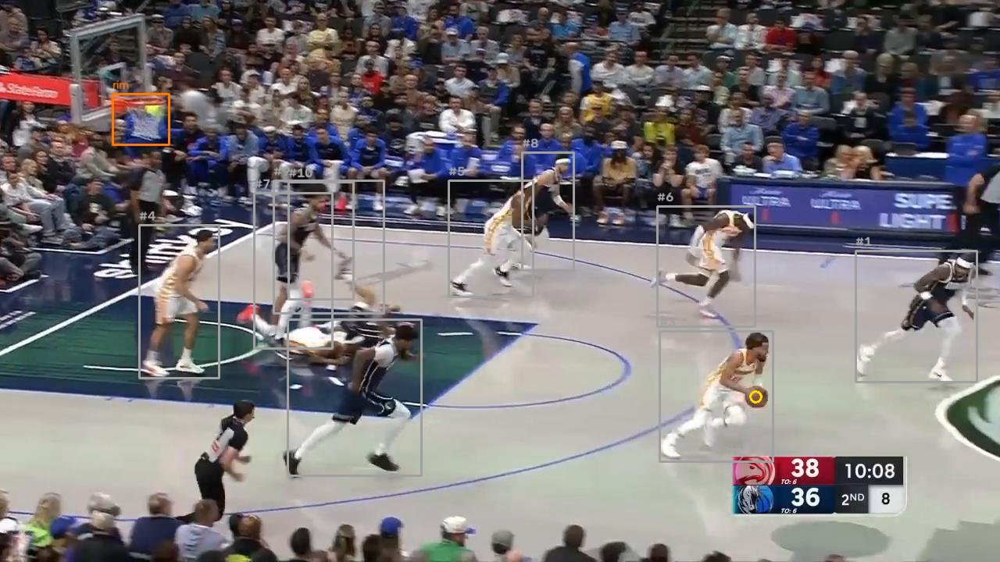
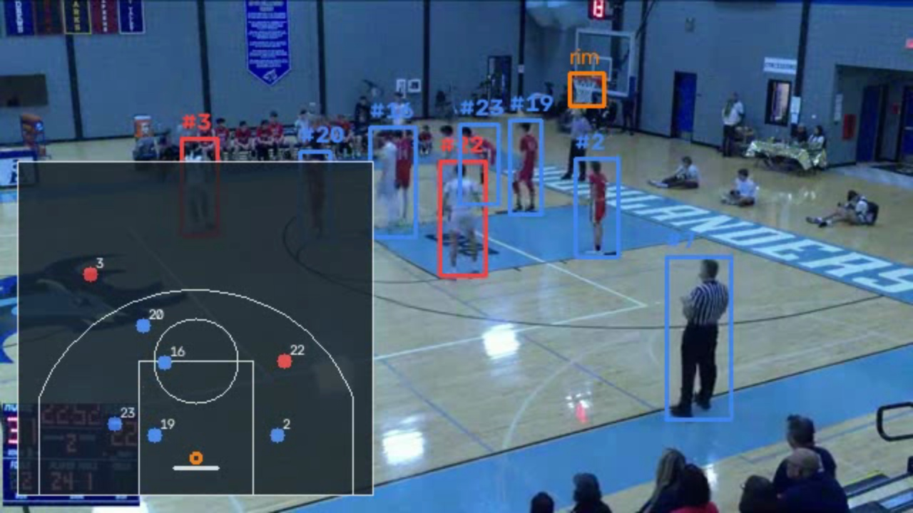
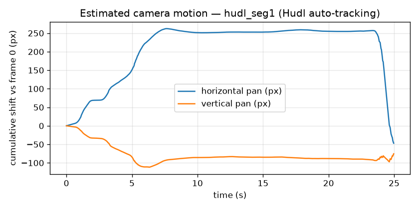
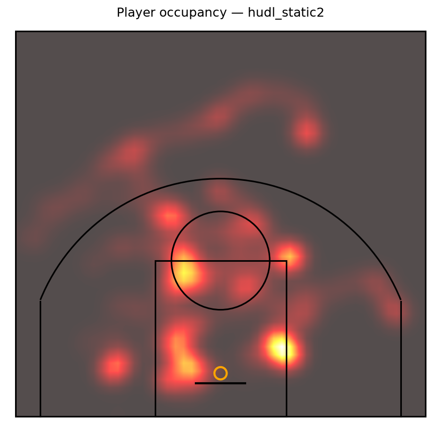
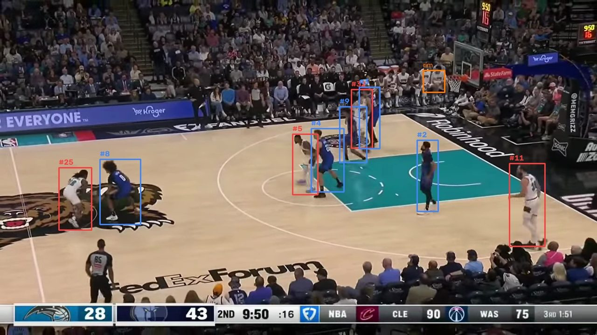
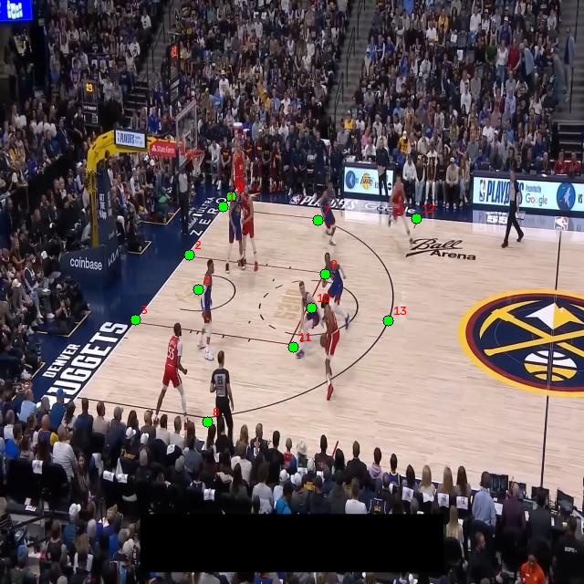

# 🏀 Hoop Vision

**Basketball video analytics from raw footage**: player detection & tracking with
persistent IDs, team assignment, court-to-2D homography (live minimap), shot attempt
detection, and automatic shot charts — plus a from-scratch object detector chapter
benchmarked against the YOLO baseline.

> _NBA Forecast Lab predicted games from tabular stats; Hoop Vision extracts those
> stats from raw video. Statistics → perception._

**🎮 [Live demo](https://hoop-vision.streamlit.app/)** — explore precomputed
sample results (tracking, minimap, shot chart) in the browser, free tier.


*Live output on a verified static clip: ByteTrack IDs with team colors, rim
detection, and the homography minimap (picture-in-picture).*


*Fine-tuned YOLO11n on a held-out val frame: 10 players, ball, and rim detected —
referees excluded by design.*


*Court homography in action during a free throw: tracked players project onto
the 2D halfcourt (picture-in-picture) with team colors and the rim marker.*

## What it does

| Capability | How |
|---|---|
| Detect players / ball / rim | YOLO11n fine-tuned on a Roboflow basketball dataset |
| Track players with stable IDs | ByteTrack + appearance track stitching (`stitch.py`) |
| Assign teams | jersey-crop LAB color features + k-means (k=2), smoothed per track |
| Map players to court coordinates | manual or auto homography → NBA halfcourt (50×47 ft) |
| Detect shot attempts & outcomes | trajectory state machine over ball + rim tracks |
| Player movement stats | per-track distance, avg/top speed, occupancy heatmap (`stats.py`) |
| Render | annotated video + picture-in-picture minimap + shot chart |
| From-scratch chapter | CenterNet-style detector in plain PyTorch ([details](scratch_detector/README.md)) |

## Architecture

```
video ──▶ ingest ──▶ detect (YOLO ▮ Detector protocol ▮ scratch) ──▶ track (ByteTrack)
                                                                        │
        ┌───────────────────────────────────────────────────────────────┤
        ▼                          ▼                                    ▼
  teams (k-means)        court (homography H)                events (state machine)
        │                          │                                    │
        └──────────────┬───────────┴───────────────┬────────────────────┘
                       ▼                           ▼
        viz: annotated video + minimap      events.json + shot chart
```

Design rule: `detect.py` exposes a `Detector` protocol, so the fine-tuned YOLO
baseline and the from-scratch detector are interchangeable in the pipeline and in
`scripts/benchmark.py`.

## Quick start

```bash
git clone https://github.com/seungminnam/hoop-vision && cd hoop-vision
uv sync                                  # installs Python 3.12 env + deps

# 1. Baseline (COCO pretrained; players + ball, no rim):
uv run python -m hoopvision.pipeline clip.mp4 --output out

# 2. Calibrate the court on a fixed-camera clip (click 4 landmarks):
uv run python scripts/calibrate.py clip.mp4 --output calib.json

# 2b. ...or recover it automatically from the painted key (colored paint,
#     static lined court) — writes an overlay JPEG so you can inspect the fit:
uv run python scripts/auto_calibrate.py clip.mp4 --weights hoopvision_best.pt \
    --output calib.json --overlay check.jpg

# 3. Full pipeline with minimap + shot analytics (needs fine-tuned weights):
uv run python -m hoopvision.pipeline clip.mp4 --weights hoopvision_best.pt \
    --calibration calib.json --output out

# Demo app (precomputed samples + local pipeline runner):
uv run streamlit run app/streamlit_app.py

# Tests / lint:
uv run pytest -q && uv run ruff check .
```

Fine-tuning and the from-scratch chapter run on **free** Colab/Kaggle GPUs — see
[`scripts/finetune_yolo.py`](scripts/finetune_yolo.py) and
[`scratch_detector/README.md`](scratch_detector/README.md).

## Results

Numbers appear here only when measured (every figure must be reproducible by
`scripts/benchmark.py`, `scripts/finetune_yolo.py` logs, or a committed notebook —
no placeholders presented as results).

**Detection (fine-tuned YOLO11n)** — measured 2026-07-07 on the
[basketball-computer-vision v14](https://universe.roboflow.com/basketballcomputervision/basketball-computer-vision/dataset/14)
val split (46 images; small dataset — 235 images total, so treat as indicative):

| class | AP50 | AP50-95 |
|---|---|---|
| player | 0.965 | 0.602 |
| ball | 0.814 | 0.423 |
| rim | 0.995 | 0.512 |
| **all (incl. referee)** | **0.919** | **0.526** |

Training: `scripts/finetune_yolo.py --epochs 60 --imgsz 960`, early-stopped at
epoch 42, 0.5 h on Apple M4 (MPS) — no cloud GPU needed for this dataset size.
Inference: **30.6 FPS** at 640 px on M4 MPS, 2.59 M params (`scripts/benchmark.py`).
Ball is the weakest class as expected (small object, motion blur) — this is why
the pipeline has the ball-coverage quality gate.

**Shot detection vs hand labels** — measured 2026-07-07 on three fixed-camera
pickup-game clips (1080p, static camera verified by frame-blend test). Ground
truth: frame-by-frame review (`data/labels/*.csv`); numbers reproduced by
`scripts/eval_shots.py`:

| clip | GT attempts | TP | FP | FN | outcomes correct |
|---|---|---|---|---|---|
| pickup_seg1 | 2 | 2 | 0 | 0 | 2/2 |
| pickup_seg2 | 1 | 1 | 0 | 0 | 1/1 |
| pickup_seg3 | 2 | 1 | 1 | 1 | 1/1 |
| **overall** | **5** | **4** | **1** | **1** | **4/4** |

Attempt **precision 80% / recall 80%** (n=5 — small sample, stated plainly);
made/missed outcome accuracy 4/4 on matched attempts. The miss was an airball
whose arc stayed outside the horizontal attempt window; the false positive was
a high pass crossing above rim level. Ball-track coverage on these clips:
42–77% (vs 2% on 360p footage — resolution is the ball detector's bottleneck).

**Tracking health (v1.1, in progress)** — the demo's most visible weakness is
ID stability. Before hand-labeling MOT ground truth, `scripts/track_diagnostics.py`
quantifies it without labels (measured 2026-07-08, `hoopvision_best.pt`, stride 1):

| clip | frames | unique IDs | players on screen (median) | fragmentation ratio | median track life | ID switches (proxy) |
|---|---|---|---|---|---|---|
| pickup_seg3 (static 1080p) | 899 | 58 | 6 | 9.7× | 1.74 s | 0 |
| hudl_seg1 (panning 360p) | 750 | 71 | 9 | 7.9× | 1.47 s | 5 |

Honest reading: **ByteTrack fragments heavily on both clips** — the average
on-screen player is split into ~8–10 IDs and a typical track survives only
~1.5 s (motion-only association, no appearance model). The panning 360p clip
adds more churn and the only detectable swap events.

Supervised baseline — measured on `pickup_label` (a hand-labeled 10 s / 300-frame
window of `pickup_seg3`, 9 players; `scripts/eval_tracking.py` vs the tracker
predictions, IoU 0.5):

| metric | value | reading |
|---|---|---|
| IDF1 | **0.730** | identity consistency on matched players |
| IDP / IDR | 0.585 / 0.970 | recall high, precision low → tracker *covers* players but over-produces IDs |
| ID switches | 1 | on clean static footage, identity is actually stable; fragmentation, not swaps, is the problem |
| MOTA | 0.341 | depressed by detection false positives — the detector fires on ~2 extra bench/partially-visible people per frame that the player-only GT excludes |

So on clean footage the tracker keeps the real players fairly stable (1 switch,
IDR 0.97) but splinters their identities across many short IDs (IDP 0.585) — the
fragmentation the demo shows.

Fix #1 — appearance track stitching (`src/hoopvision/stitch.py`): an offline
pass re-attaches fragmented tracks that end and reappear nearby within a few
frames with a similar torso-color histogram (union-find, disjoint frame ranges
so distinct players never merge). On by default in the pipeline; before/after
on the same GT:

| | IDF1 | IDP / IDR | ID switches | unique IDs | median track life |
|---|---|---|---|---|---|
| raw ByteTrack | 0.730 | 0.585 / 0.970 | 1 | 19 | 1.8 s |
| + stitching | **0.752** | 0.603 / **1.000** | **0** | **14** | **4.4 s** |

The IDF1 gain is modest (+2 pts — on a clean clip ByteTrack already had one
switch, so frame-weighted identity was already decent), but the fragmentation
metrics move clearly: **median track life 2.4× longer, 26% fewer IDs, zero
switches, and no regression** (no distinct players were wrongly merged). MOTA is
unchanged (0.341 → 0.342) because it is dominated by out-of-scope detector FPs,
which stitching does not remove.

Fix attempt #2 — camera-motion compensation (`src/hoopvision/motion.py`): a
global affine, estimated from background optical flow (players masked), maps
each frame back to a reference so the tracker sees a stabilised scene. The
estimator works — it recovers synthetic warps in tests and cleanly captures the
real pan on the auto-tracking Hudl clip (below):



But honestly, **warping boxes into the reference frame did not improve tracking**
on `hudl_seg1` (median track life 3.4 s → 3.0 s, unique IDs unchanged) — likely
because this is a ball-following camera (pan is correlated with play) and the
cumulative transform drifts over 750 frames. It is a no-op on static clips
(identical numbers). So it stays **off by default** for tracking; its real
payoff is as the reusable foundation for v2 dynamic homography (keeping the
minimap aligned on a moving camera). A measured negative result, kept honest.

**Player movement stats** — with stable tracks + a court homography, each
track becomes a path in feet, so `scripts/player_stats.py` reports distance,
speed, and a court-occupancy heatmap in physical units. Measured on
`hudl_static2` (calibrated static clip); the longest-lived tracks (the
reliable per-player rows) over a 21 s possession:

| track | team | seconds | distance (ft) | avg (mph) | top (mph) |
|---|---|---|---|---|---|
| 8 | 0 | 20.8 | 85.8 | 2.8 | 10.9 |
| 3 | 1 | 21.0 | 73.8 | 2.4 | 7.4 |
| 9 | 1 | 20.9 | 72.3 | 2.4 | 7.5 |

(Calibrated with the NCAA court profile — `hudl_static2`'s true geometry, 0.87 ft
paint-corner reprojection; the earlier NBA-assumed homography over-scaled these
distances. See [ROADMAP.md](ROADMAP.md) §4.1.)



Distances and walking-to-jogging average speeds (2–3 mph, top bursts ~7–11 mph)
are physically sensible for a half-court set, and the heatmap concentrates in
the paint and along the arc as expected. Honest caveats: numbers are per
*track* not per named player (jersey OCR is future work), so short tracks are
still fragments; the 360p source jitters, which inflates top-speed; and some
tracks are bench/non-players. This is the first "advanced stat" and the bridge
to game-flow features — see [docs/reference-analysis.md](docs/reference-analysis.md)
and [ROADMAP.md](ROADMAP.md).

**Scratch detector vs YOLO** — measured 2026-07-08, same val split and clip,
Apple M4 MPS (`scripts/benchmark.py`; details + training curves in
[scratch_detector/README.md](scratch_detector/README.md)):

| model | player AP50 | FPS | params (M) |
|---|---|---|---|
| fine-tuned YOLO11n | 0.965 | 34.0 | 2.59 |
| scratch CenterNet-lite (plain PyTorch) | 0.578 | 40.1 | 12.84 |

The from-scratch detector is *faster* but far less accurate on 165 training
images — the write-up documents why (pretraining, augmentation recipe,
multi-scale assignment), which is the point of the chapter.

**Generalization to real NBA broadcast** — the detector was fine-tuned on a
small amateur dataset, so how does it fare on out-of-domain pro footage? Run on
a continuous 20 s possession from an NBA broadcast (720p, different court /
jerseys / camera / graphics — never seen in training):



| signal | result |
|---|---|
| players on court per frame | median **10** (exactly a live possession) |
| rim detected | **98%** of frames |
| ball detected | 42% of frames (small/fast, as on our own clips) |
| crowd false positives | **none** — spectators aren't boxed as players |

It transfers well: 10 players, the rim, and no crowd false positives, with the
referee correctly excluded. What does *not* transfer is everything downstream of
a fixed camera — the broadcast pans and cuts (our camera-motion estimator finds
the cut and measures the ~2 px/frame follow), so the minimap, court stats, and
shot events don't apply. That moving-camera case is exactly what
[ROADMAP.md](ROADMAP.md) v2 (dynamic homography) targets. Team colors are
roughly split by k-means but not aligned to the true teams (a known limitation).
Raw broadcast video is never committed — only this single annotated frame.

**v2 — Court registration on NBA broadcast (in progress).** The moving-camera
gap above is what v2 tackles: detect court landmarks per frame, then recover a
per-frame homography. Phase 1 (the detector) is done — a YOLO11n-pose model
fine-tuned on a public 33-point court-keypoint dataset of **18 NBA playoff
games** (`roboflow-jvuqo/basketball-court-detection-2`, CC BY 4.0), the
north-star domain. On the held-out **NBA test split**:

| metric (test, 101 frames) | value |
|---|---|
| keypoint mAP50 | **0.985** |
| keypoint mAP50-95 | 0.878 |
| keypoint precision / recall | 0.98 / 0.98 |
| court-box mAP50 | 0.995 |



Trained 100 epochs on Apple M4 MPS (`scripts/train_court_pose.py`); weights are
[release v0.4.0](https://github.com/seungminnam/hoop-vision/releases/tag/v0.4.0).
This adopts a real multi-venue NBA dataset instead of overfitting our single
NCAA clip (rationale in [docs/decisions.md](docs/decisions.md) ADR-003/004).
Phase 2 turns these keypoints into a homography: the 33-point court template has
no published real-world coordinates, but it is recoverable from the labels
themselves (`scripts/recover_court_template.py` places all 33 points into one
frame at 0.73 px median consistency), then anchored to NBA court dimensions.

## Demo app

**Live: [hoop-vision.streamlit.app](https://hoop-vision.streamlit.app/)**

The Streamlit app explores precomputed sample results (annotated video,
minimap, shot chart, **player movement stats + occupancy heatmap**, events)
and can run the full pipeline locally on an uploaded clip.

Deployed on **Streamlit Community Cloud (free)**: repo
`seungminnam/hoop-vision`, branch `main`, entrypoint `app/streamlit_app.py`.
[`app/requirements.txt`](app/requirements.txt) keeps the hosted environment
minimal (Streamlit only — the cloud app serves precomputed samples; video
inference exceeds the free tier and stays local, as noted in the app).

## $0 operations

Everything in this project runs on free tiers:

| Need | Free service |
|---|---|
| GPU fine-tuning | Google Colab free T4 / Kaggle (30 h/wk P100) |
| Dataset | Roboflow Universe public datasets (free API key) |
| Local inference | MacBook Apple Silicon (PyTorch MPS) |
| Demo hosting | Streamlit Community Cloud |
| Repo + CI | GitHub public repo + Actions free minutes |

## Honest limitations (v1)

- **Fixed-camera clips only** for homography/minimap and shot analytics; broadcast
  pans/cuts get detection + tracking + teams only. Keypoint-based dynamic homography
  is future work.
- **Ball detection is flaky** (small object, motion blur). The pipeline linearly
  interpolates short gaps, and if ball-track coverage is <40% of frames it reports
  shot analytics as *unavailable* rather than emitting low-confidence events.
- No jersey-number OCR or cross-cut re-identification; offline processing only.

## Repo map

```
src/hoopvision/     pipeline modules (ingest → detect → track → teams → court → events → viz)
scratch_detector/   from-scratch CenterNet-style detector + training/eval
scripts/            calibrate, auto_calibrate, download_data, finetune_yolo, benchmark
app/                Streamlit demo (+ precomputed samples for the free-tier deploy)
tests/              unit tests for the pure-logic modules (court, events, teams)
data/               gitignored; dataset/clip documentation in data/README.md
```

## Status

Building in public, Jul–Aug 2026 ([SPEC.md](SPEC.md) has the weekly milestones):

- [x] W1 — baseline pipeline: detection, ByteTrack IDs, annotated video, tests
- [x] W2a — fine-tune YOLO11n on player/ball/rim (mAP50 0.919, table above)
- [x] W2b — team assignment verified on a real game clip (white vs red jerseys
  mostly separated at 360p; occasional flips on small crops — noted limitation)
- [x] W3 — homography + minimap, verified on a static lined-court clip
  (`docs/sample_minimap.jpg`; calibration = paint-region corners + curve
  refinement). Paint-corner reprojection is **0.87 ft** — under the 1 ft target
  once the correct NCAA court geometry is used (v1 assumed NBA dimensions and
  got 1.7 ft; see the v2 court-profile note in ROADMAP §4.1). See
  `calib_hudl_static2.json`.
- [x] W4 — shot events vs hand-labeled ground truth (80%/80% on 3 clips, n=5;
  shot-chart court coordinates pending W3 calibration)
- [x] W5 — from-scratch detector benchmark (player AP50 0.578 vs YOLO 0.965;
  table above, analysis in `scratch_detector/README.md`)
- [x] W6 — deployed demo + write-up: live at
  [hoop-vision.streamlit.app](https://hoop-vision.streamlit.app/)

v1 is complete. What comes next — tracking robustness (MOT metrics + camera
motion compensation), dynamic homography for panning cameras, and the
"Hudl-lite" game-report product — is planned in [ROADMAP.md](ROADMAP.md).

## License

[MIT](LICENSE)
