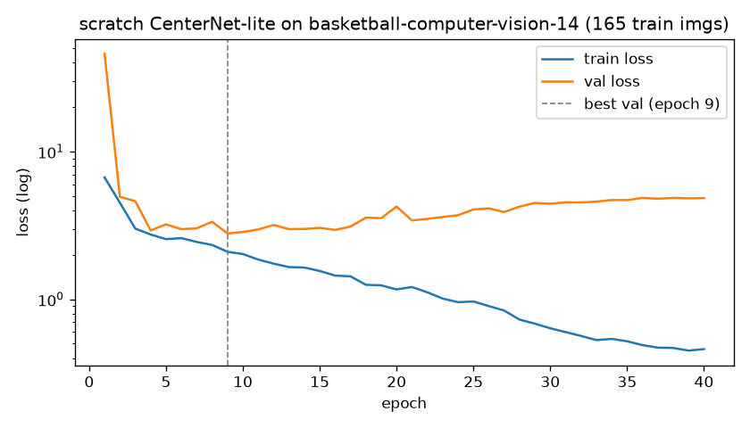

# From-scratch chapter: a minimal anchor-free detector

This package continues the "CNN from scratch" series: a CenterNet-style,
single-class (player) object detector implemented in plain PyTorch — no
`ultralytics` calls — benchmarked honestly against the fine-tuned YOLO baseline.

## Architecture

```
input 512×512 ── ResNet18 (stride 32) ── 3× [Upsample ×2 + Conv-BN-ReLU] ── stride-4 features
                                                                              ├── heatmap head (1ch): object-center probability
                                                                              ├── wh head      (2ch): box size in grid units
                                                                              └── offset head  (2ch): sub-cell center offset
```

Hand-implemented pieces (see the source — each is short):

| Piece | File | Idea |
|---|---|---|
| Gaussian target splatting | `data.py` | soft positives around each GT center (CornerNet radius) |
| Penalty-reduced focal loss | `loss.py` | down-weight negatives near GT centers |
| Max-pool NMS decoding | `model.py` | a peak survives iff it's the 3×3 local max |
| AP50 evaluation | `eval.py` | greedy IoU matching + PR-curve area, by hand |

## Train / evaluate ($0: Colab or Kaggle free GPU, or MPS locally)

```bash
uv run python -m scratch_detector.train --data data/<dataset>/data.yaml --epochs 40
uv run python -m scratch_detector.eval  --data data/<dataset>/data.yaml
uv run python scripts/benchmark.py --weights hoopvision_best.pt --video demo.mp4 \
    --scratch-weights scratch_detector/runs/best.pt
```

## Results

Measured 2026-07-08 on the basketball-computer-vision v14 val split (46
images); FPS on the same 1080p clip for both models, Apple M4 (MPS), via
`scripts/benchmark.py`:

| model | player AP50 | FPS (M-series MPS) | params (M) |
|---|---|---|---|
| fine-tuned YOLO11n | 0.965 | 34.0 | 2.59 |
| scratch CenterNet-lite | 0.578 | 40.1 | 12.84 |

Training: 40 epochs, batch 16, ~34 s/epoch on M4 (≈23 min total — no cloud
GPU needed). `best.pt` is the min-val-loss checkpoint (epoch 9); after that
the model memorizes the 165 training images while val loss climbs back up:



## Why it loses (the actual point of the chapter)

- **Data appetite.** The ImageNet-pretrained ResNet18 backbone helps, but the
  three upsampling blocks and all three heads start from random weights, and
  165 images can't feed them — hence the early overfit at epoch 9. YOLO11n
  starts from COCO weights where every stage has already seen ~118k images
  of people.
- **Augmentation gap.** This trainer does flips + color jitter; ultralytics
  layers mosaic, mixup, scale/translate jitter and more on top, which is worth
  a lot of effective dataset size on 165 images.
- **Assignment & head design.** Penalty-reduced focal loss on a single-scale
  stride-4 heatmap vs. YOLO's task-aligned assignment over multi-scale
  features — small/overlapping players suffer most at a single scale.
- **Speed is not the bottleneck.** The scratch model is actually *faster*
  (40 vs 34 FPS) despite 5× the parameters: a plain ResNet18 + 3×3-max-pool
  decode is memory-friendly on MPS and skips YOLO's post-processing — the
  accuracy gap, not throughput, is what pretraining and a mature training
  recipe buy.
